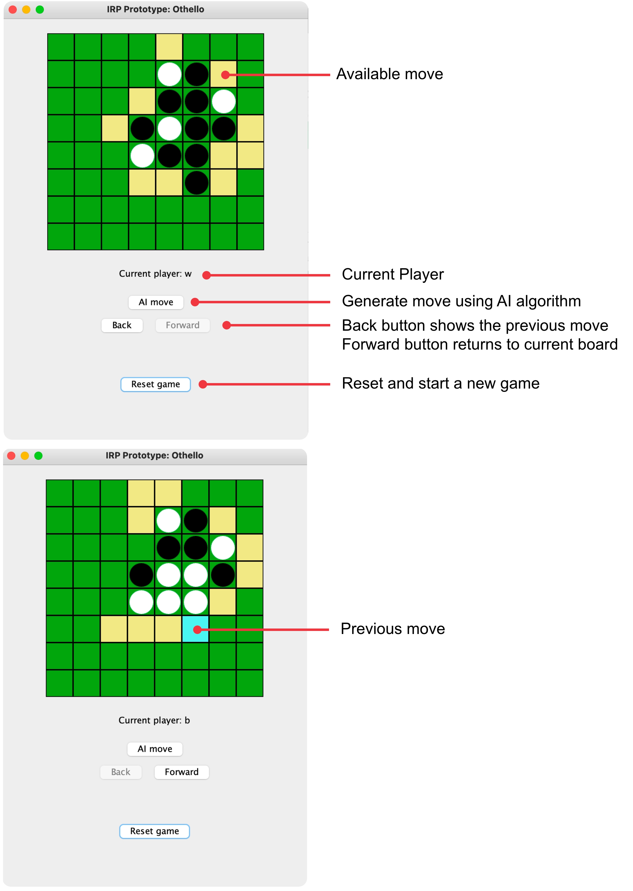

# IRP-Prototype-Othello

A protoype for the game Othello using the following search algorithms to generate moves:
* Minimax
* Alpha-beta pruning
* Monte Carlo tree search

## Tech
* Java 
* JUnit
* Swing

## UI

## Othello
Othello is played on an 8x8 board with discs that are white on one side and black on the other. One player is assigned the colour white and the other player is assigned the colour black. The aim of the game is to have the highest number of discs showing your colour when all squares are taken. This is achieved by flipping your opponent’s discs to show your colour.

To flip your opponent’s disc you must surround their disc(s) with your own so that the opponent’s disc(s) are flanked by yours in at least one direction. This can happen horizontally, vertically, or diagonally.

If one player is unable to take a move, i.e. there are no available squares, they skip a turn until they are able to make a move. At the end of the game, when all squares are occupied, the player with the greatest amount of discs on the board wins.

## Run the Program
* Open terminal
* Navigate to the bin directory in the project files
* Run `java Othello`
